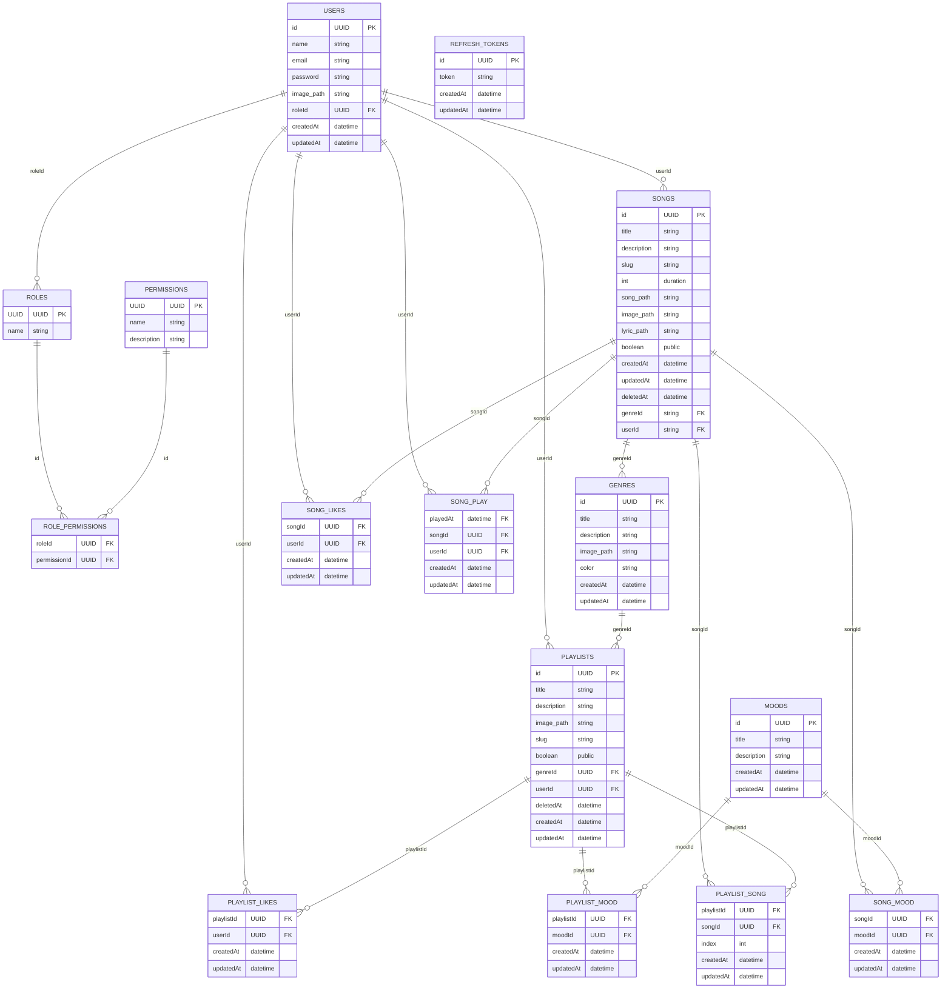

## Lược đồ cơ sở dữ liệu

```mermaid
erDiagram
    USERS {
        id UUID PK
        name string
        email string
        password string
        image_path string
        roleId UUID FK
        createdAt datetime
        updatedAt datetime
    }
    ROLES {
        UUID UUID PK
        name  string
    }
    PERMISSIONS {
        UUID UUID PK
        name string
        description string
    }
    ROLE_PERMISSIONS {
        roleId UUID FK
        permissionId UUID FK
    }
    PLAYLISTS {
        id UUID PK
        title string
        description string
        image_path string
        slug string
        boolean public
        genreId UUID FK
        userId UUID FK
        deletedAt datetime
        createdAt datetime
        updatedAt datetime
    }
    PLAYLIST_LIKES {
        playlistId UUID FK
        userId UUID FK
        createdAt datetime
        updatedAt datetime
    }
    PLAYLIST_MOOD {
        playlistId UUID FK
        moodId UUID FK
        createdAt datetime
        updatedAt datetime
    }
    PLAYLIST_SONG {
        playlistId UUID FK
        songId UUID FK
        index int 
        createdAt datetime
        updatedAt datetime
    }
    GENRES {
        id UUID PK
        title string
        description string
        image_path string
        color string
        createdAt datetime
        updatedAt datetime
    }
    MOODS {
        id UUID PK
        title string
        description string
        createdAt datetime
        updatedAt datetime
    }
    SONGS {
        id UUID PK
        title string
        description string
        slug string
        int duration
        song_path string
        image_path string
        lyric_path string
        boolean public
        createdAt datetime
        updatedAt datetime
        deletedAt datetime
        genreId string FK
        userId string FK
    }
    SONG_LIKES {
        songId UUID FK
        userId UUID FK
        createdAt datetime
        updatedAt datetime
    }
    SONG_MOOD {
        songId UUID FK
        moodId UUID FK
        createdAt datetime
        updatedAt datetime
    }
    SONG_PLAY {
        playedAt datetime FK
        songId UUID FK
        userId UUID FK
        createdAt datetime
        updatedAt datetime
    }
    REFRESH_TOKENS {
        id UUID PK
        token string
        createdAt datetime
        updatedAt datetime
    }

    %% Relationships
    USERS ||--o{ ROLES : "roleId"
    ROLES ||--o{ ROLE_PERMISSIONS : "id"
    PERMISSIONS ||--o{ ROLE_PERMISSIONS : "id"
    USERS ||--o{ PLAYLISTS : "userId"
    USERS ||--o{ SONGS : "userId"
    USERS ||--o{ PLAYLIST_LIKES : "userId"
    USERS ||--o{ SONG_LIKES : "userId"
    USERS ||--o{ SONG_PLAY : "userId"
    SONGS ||--o{ GENRES : "genreId"
    SONGS ||--o{ SONG_LIKES : "songId"
    SONGS ||--o{ SONG_MOOD : "songId"
    SONGS ||--o{ PLAYLIST_SONG : "songId"
    SONGS ||--o{ SONG_PLAY : "songId"
    GENRES ||--o{ PLAYLISTS : "genreId"
    PLAYLISTS ||--o{ PLAYLIST_LIKES : "playlistId"
    PLAYLISTS ||--o{ PLAYLIST_MOOD : "playlistId"
    PLAYLISTS ||--o{ PLAYLIST_SONG : "playlistId"
    MOODS ||--o{ PLAYLIST_MOOD : "moodId"
    MOODS ||--o{ SONG_MOOD : "moodId"
```
